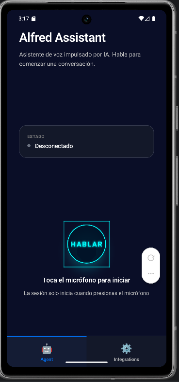

# Alfred — Asistente de Voz IA

Aplicación móvil construida con React Native + Expo que implementa una experiencia de asistente conversacional por voz en tiempo real usando ElevenLabs.

---

## 🇪🇸 Versión en Español

### Resumen

Aplicación enfocada en:

- Diseñar una arquitectura modular y escalable por features.
- Integrar servicios de voz en tiempo real (WebRTC + LiveKit + ElevenLabs).
- Resolver problemas reales de producto: reconexión, manejo de errores, estado de UI y experiencia multiplataforma.
- Mantener calidad de código con TypeScript estricto y tipado seguro.

### Qué hace hoy

- Conversación de voz en tiempo real con agente de ElevenLabs.
- Control de sesión (iniciar/finalizar), control de micrófono y estados de conexión.
- Manejo de errores y reconexión limitada con reintento manual.
- Navegación por tabs con Expo Router.
- Fallback específico para web para evitar dependencias nativas no soportadas.

### Capturas (App / Web)




### Stack técnico

- React Native `0.81.5`
- Expo `~54.0.33`
- React `19.1.0`
- TypeScript `~5.9.2` (strict)
- Expo Router `^6.0.23`
- ElevenLabs RN SDK `^0.5.10`
- LiveKit (`@livekit/react-native`, `livekit-client`)

### Arquitectura

```text
Alfred-asistente-ia/
├── app/
│   ├── _layout.tsx
│   ├── _layout.web.tsx
│   └── (tabs)/
│       ├── _layout.tsx
│       ├── index.tsx
│       └── integrations.tsx
├── index.ts
└── src/
    ├── features/
    │   ├── elevenlabs/
    │   │   ├── config/
    │   │   ├── hooks/
    │   │   ├── screens/
    │   │   └── styles/
    │   ├── assistant/
    │   │   ├── domain/
    │   │   ├── application/
    │   │   ├── infrastructure/
    │   │   ├── components/
    │   │   ├── hooks/
    │   │   ├── screens/
    │   │   └── types/
    │   └── integrations/
    └── shared/
        ├── components/
        ├── providers/
        ├── services/
        ├── types/
        └── utils/
```

### Arquitectura explicada

- `app/`: define navegación con Expo Router y layouts por plataforma (`_layout.tsx` para nativo y `_layout.web.tsx` para web).
- `features/elevenlabs`: concentra configuración, estado de conversación, UI de agente y estilos específicos de voz.
- `features/assistant`: módulo separado por capas (`domain`, `application`, `infrastructure`) para desacoplar tipos, casos de uso y servicios.
- `features/integrations`: punto de extensión para integraciones externas (actualmente base funcional).
- `shared/`: componentes y utilidades reutilizables (`components`, `providers`, `services`, `types`, `utils`).

### Flujo de ejecución (voz)

1. La pantalla de agente inicializa el hook de conversación y valida configuración (`agentId`).
2. Se inicia sesión con ElevenLabs y se sincroniza estado de conexión en UI.
3. El usuario activa/desactiva micrófono; el hook refleja estado local y de sesión.
4. Ante desconexiones no manuales, se aplican reintentos acotados.
5. Si se alcanza el límite de reintentos, se bloquea auto-reconexión y queda habilitado reintento manual.

### Decisiones técnicas

- Configuración de agente por `EXPO_PUBLIC_ELEVENLABS_AGENT_ID` con fallback a `app.json`.
- Separación web/native en layout y pantalla para prevenir errores de runtime en web.
- Estado de conexión controlado desde hook para evitar inconsistencias de UI.
- Estrategia de reconexión con límite de intentos para no quedar en bucles.
- Re-exports de compatibilidad al refactorizar `assistant` a capas.

### Setup rápido

1. Instalar dependencias

```bash
npm install --legacy-peer-deps
```

2. Configurar variables de entorno

Crea `.env` basado en `.env.example`:

```env
EXPO_PUBLIC_ELEVENLABS_AGENT_ID=YOUR_AGENT_ID_HERE
```

También se soporta `expo.extra.elevenlabs.agent_id` en `app.json`.

3. Ejecutar

```bash
npm run android
```

Opcional:

```bash
npm run ios
npm run web
```

### Validación técnica

```bash
npx tsc --noEmit
```

Estado actual: compilación TypeScript en verde.

### Limitaciones conocidas

- La experiencia principal de voz está enfocada en Android/iOS (Dev Client), no en Expo Go.
- La calidad de conexión depende de red/dispositivo; se implementó manejo de errores y recuperación controlada.

### Roadmap corto

- Integraciones productivas (Gmail/Calendar).
- Persistencia de historial de conversación.
- Pulido de indicadores de estado y telemetría básica.

### Perfil del proyecto

Enfoque técnico principal:

- Arquitectura frontend móvil.
- Integración de SDKs de tiempo real.
- Resolución de bugs complejos de runtime y navegación.
- Enfoque en DX, mantenibilidad y escalabilidad.

---

## 🇺🇸 English Version

### Summary

Application focused on:

- Design a modular and scalable feature-based architecture.
- Integrate real-time voice services (WebRTC + LiveKit + ElevenLabs).
- Solve real product-level issues: reconnection, error handling, UI state management, and cross-platform behavior.
- Maintain code quality with strict TypeScript and safe typing.

### Current Capabilities

- Real-time voice conversation with an ElevenLabs agent.
- Session lifecycle control (start/end), microphone control, and connection states.
- Error handling and bounded reconnection with manual retry.
- Tab navigation using Expo Router.
- Web-specific fallback to avoid unsupported native runtime dependencies.

### Screenshots (App / Web)


### Tech Stack

- React Native `0.81.5`
- Expo `~54.0.33`
- React `19.1.0`
- TypeScript `~5.9.2` (strict)
- Expo Router `^6.0.23`
- ElevenLabs RN SDK `^0.5.10`
- LiveKit (`@livekit/react-native`, `livekit-client`)

### Architecture explained

- `app/`: defines routing with Expo Router and platform-specific layouts (`_layout.tsx` for native and `_layout.web.tsx` for web).
- `features/elevenlabs`: groups voice configuration, conversation state, agent UI, and voice-specific styles.
- `features/assistant`: layered module (`domain`, `application`, `infrastructure`) to separate types, use cases, and services.
- `features/integrations`: extension point for external integrations (currently baseline implementation).
- `shared/`: reusable building blocks (`components`, `providers`, `services`, `types`, `utils`).

### Runtime flow (voice)

1. The agent screen initializes the conversation hook and validates configuration (`agentId`).
2. A session is started with ElevenLabs and connection state is synchronized with the UI.
3. The user toggles microphone state; the hook updates local and session state.
4. On non-manual disconnects, bounded reconnection attempts are applied.
5. When retry limit is reached, auto-reconnect is blocked and manual retry remains available.

### Technical Decisions

- Agent configuration via `EXPO_PUBLIC_ELEVENLABS_AGENT_ID` with `app.json` fallback.
- Web/native split in layout and screen to prevent web runtime crashes.
- Hook-driven connection state to keep UI state consistent.
- Bounded reconnection strategy to avoid infinite loops.
- Compatibility re-exports after refactoring `assistant` into layered architecture.

### Quick Setup

1. Install dependencies

```bash
npm install --legacy-peer-deps
```

2. Configure environment variables

Create `.env` from `.env.example`:

```env
EXPO_PUBLIC_ELEVENLABS_AGENT_ID=YOUR_AGENT_ID_HERE
```

`expo.extra.elevenlabs.agent_id` in `app.json` is also supported.

3. Run

```bash
npm run android
```

Optional:

```bash
npm run ios
npm run web
```

### Technical Validation

```bash
npx tsc --noEmit
```

Current status: TypeScript compilation is passing.

### Known Limitations

- The main voice experience is focused on Android/iOS (Dev Client), not Expo Go.
- Connection quality depends on network/device conditions; controlled recovery and error handling are implemented.

### Short Roadmap

- Production-ready integrations (Gmail/Calendar).
- Persistent conversation history.
- Additional state indicators and basic telemetry.

### Technical Scope

Primary technical focus:

- Mobile frontend architecture.
- Real-time SDK integration.
- Runtime and navigation debugging in complex scenarios.
- DX, maintainability, and scalability.
